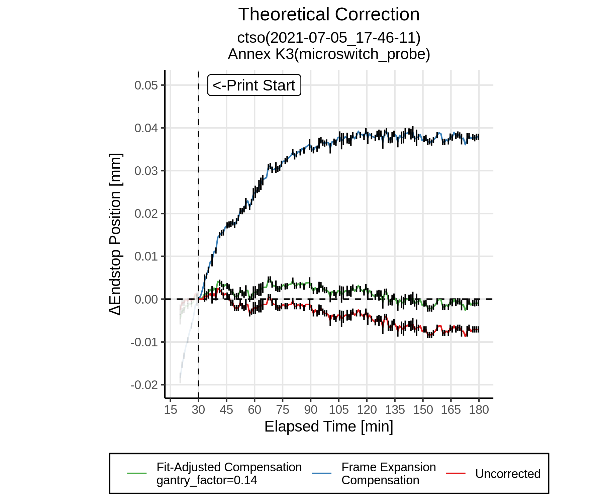
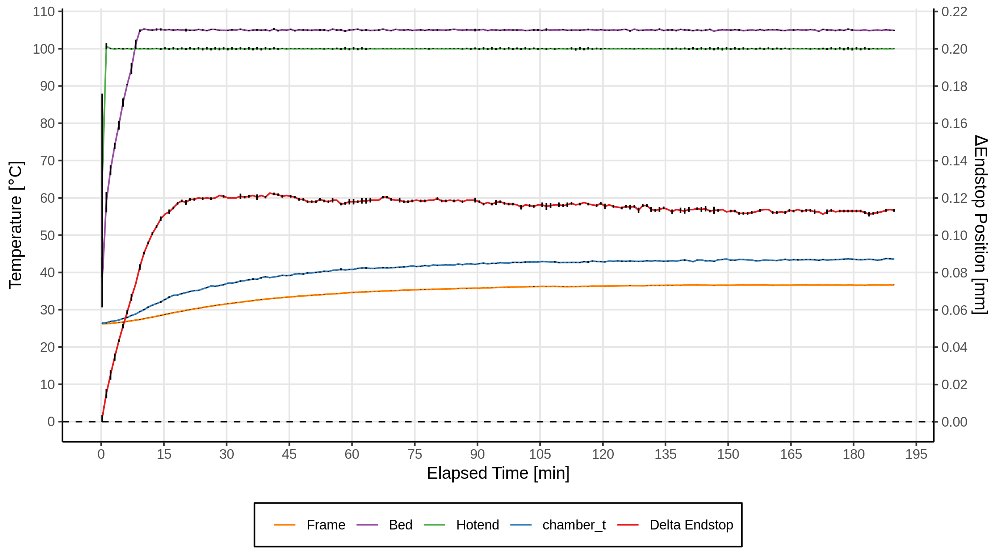
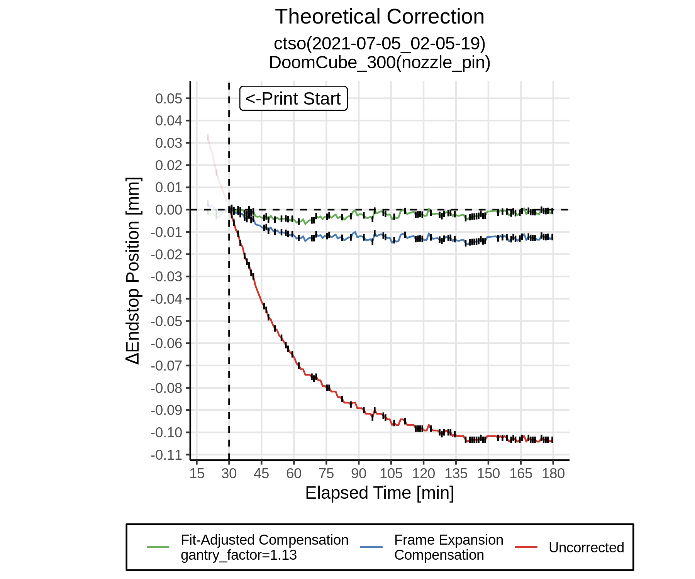

# Annex Engineering K3 Frame Expansion Compensation

I decided to experiment with [alchemyEngine's frame expansion compensation](https://github.com/alchemyEngine/klipper/tree/work-frame-expansion-20210410)
support for Klipper after experimenting with it on my Voron V2 (modded to be a [DoomCube](https://github.com/FrankenVoron/DoomCube-2)).

Frame expansion compensation aims to automatically adjust Z throughout a print to compensate for expansion of the 2020 extrusions as they heat up.

Data is collected by homing Z every minute for 3 hours with the bed set to 105C and hotend set to 100C.  [This script](https://gist.github.com/alchemyEngine/6d42bb1ea391bf5d587625d64e5acfe7) records the MCU's Z position (in steps), frame temperature, bed temperature, chamber temperature, hotend temperature etc.

Once the data is collected it is analyzed using [this R script](https://gist.github.com/alchemyEngine/ed3fedf5bb6cc48cc236984092d0d518).  This aims to determine a gantry factor (how much to adjust Z by given 1mm of expansion in the 2020 verticals).  It also provides some cool graphs to explore the collected data.

## Run 1
*Data*: [expansion_quant_ctso_2021-07-05_17-46-11.csv](data/expansion_quant_ctso_2021-07-05_17-46-11/expansion_quant_ctso_2021-07-05_17-46-11.csv)
*Frame Thermistor Location*: Top rear horizontal extrusion, in the extrusion slot, covered by a printed cover.
*Calculated Gantry Factor*: 0.14

### Graphs

### Thoughts

I think there are a number of things that could be yielding results that are very different than my Voron V2, for example:

- The thermistor location is less than ideal.  Waiting on some bead thermistors and will get one shoved into the center of a vertical extrusion.
- The Z leadscrews may be expanding at a similar rate to the frame, canceling out any expansion in the frame.
- The side panels may be providing enough reinforcement to resist any frame expansion.  I would expent the panels to expand a bit too, but they are basically giant heatsinks so maybe not by much.,

These results are very interesting especially in comparison to my V2 (graph below for reference).  Will be interesting to see if a belted Z has any difference here.

#### Voron V2 Results - For Comparison

